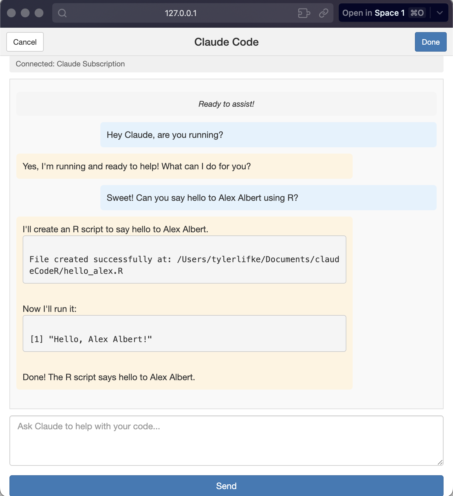
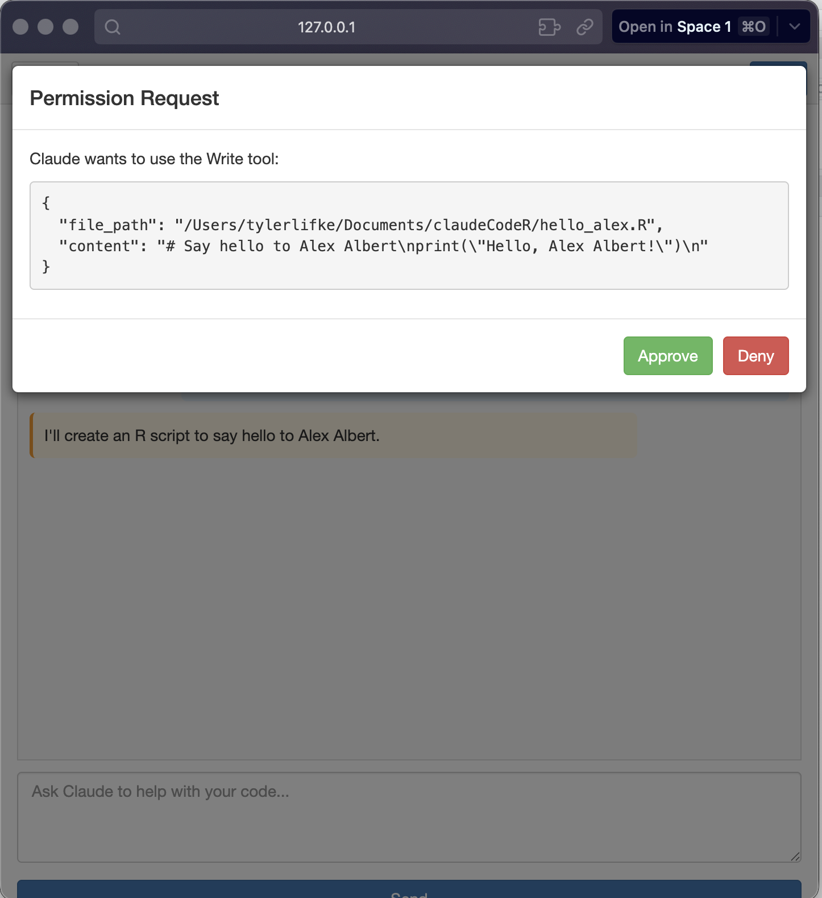
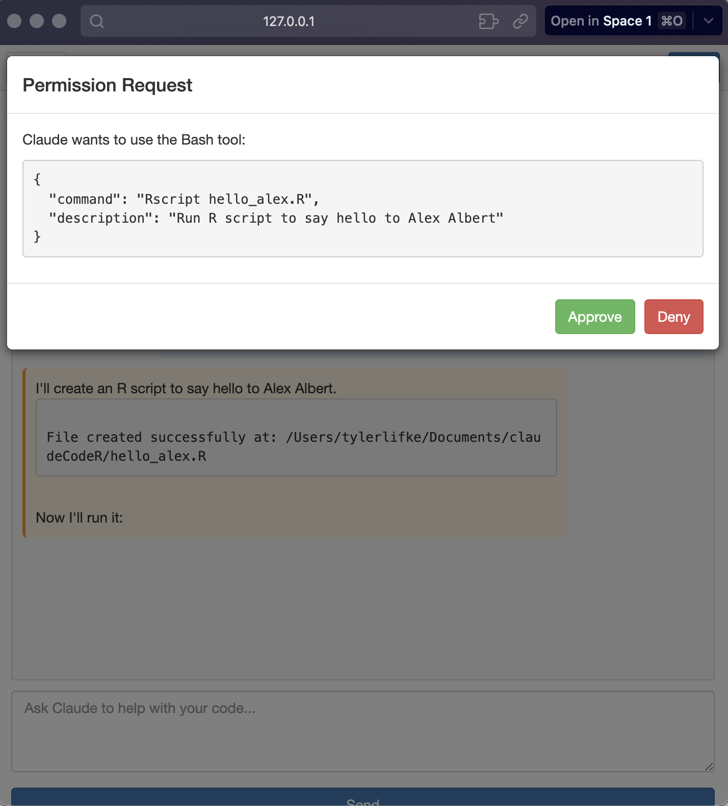

# claudeCodeR

Claude Code AI assistant integration for RStudio.



## Quick Start

**1. Install the package:**

```r
install.packages("remotes")
remotes::install_github("tlifke/claudeCodeR")
```

**2. Authenticate** (choose one):

```bash
# Option 1: Use Claude CLI (recommended)
claude auth login
```

```r
# Option 2: Set API key
usethis::edit_r_environ()
# Add: ANTHROPIC_API_KEY=your_api_key_here
# Restart R session
```

**3. Launch the SDK-based interface:**

```r
# From R console
library(claudeCodeR)
claude_code_addin()

# Or: RStudio → Addins → "Claude Code"
```

First launch sets up Python environment (~1 minute). Subsequent launches are instant.

## Features

- Multi-turn conversations with context memory
- File operations and bash command execution
- Real-time streaming responses
- Editor integration




## Requirements

- RStudio
- R 4.0+
- Python 3.10+
- Claude Pro/Team subscription or Anthropic API key

## Troubleshooting

**Server won't start?**
```bash
python3 --version  # Check version is 3.10+
rm -rf ~/.claude-rstudio-venv  # Reset environment
```

**Authentication issues?**
Run `claude auth login` or set `ANTHROPIC_API_KEY` in `.Renviron`

## Version History

### v0.3.0 (Current - SDK-based)
- Production-ready SDK-based architecture
- Multi-turn conversations with full context memory
- Tool execution works correctly (file writes, bash commands)
- Streaming responses via SSE

### v0.2.0 (Archived - ACP WebSocket)
- WebSocket-based ACP implementation
- See `.claude/tasks/acp-websocket-integration/COMPLETED.md`

### v0.1.0 (Archived - ACP stdio)
- Custom ACP protocol over stdio
- See `ISSUES.archive.md`

## License

MIT
